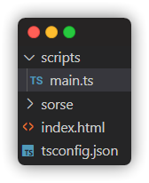

# Making your first Sorse Engine game

Creating games in Sorse Engine is easy! This tutorial will show how to create your very first game

## What game should you make?

You could make any game you choose but for this tutorial we're going to make a simple clicker game

## Getting started

In order to start making games in Sorse Engine complete our [Getting Started](https://blocksnmore.github.io/Sorse-Engine/setup/) guide.

## Setting up our enviroment

For this example we will be using VSCode & the Intelli-Sense plugin.
Set up a new project in VSCode and add the Sorse folder from the [Releases Page](https://github.com/Blocksnmore/Sorse-Engine/releases) into your project.
Create an `index.html` file which will be our main file and insert the following code:

```html
<body>
	<script
		src="sorse/loader/loader.js"
		onload="(()=>{
			new SorseGame({
				name: 'My first game',
				gameScripts: [],
				author: 'Sorse Engine Documentation',
				version: '1.0.0',
				description: 'Tutorial game for the Sorse Engine Docs',
			});
		})()"
	></script>
</body>
```

Finally create a file called `tsconfig.json` with the following content:

```json
{
	"compilerOptions": {
		"lib": ["ES2015", "DOM"]
	}
}
```

Now we're ready to start coding!

## Creating our script

Create a new folder called `scripts` in the root directory, then create a file called `main.ts`.
This should be your current structure: <br>

<br>
Now write the following in `main.ts`:

```ts
new SorseScript({
	name: 'Main script',
	onReady(sorse) {
		// Ready Code
	},
	onRender(sorse) {
		// Render Code
	},
	onInput(sorse, event) {
		// Input Code
	},
});
```

Now we have our completed script file!

## Writing the game logic

Now that our script is compled we can start writing our code!

### Ready Function

First we're going to start writing our `onReady` function.
You should use the `onReady` function to initialize all of your variables, so let's do that!
Our game is going to use 4 variables: `clicks`, `upgrades`, `upgradeCost`, and `upgradeMultiplier`.
You also want to configure your game FPS here.
Use the following code to initialize the variables:

```ts
sorse.setGameFPS(30);
sorse.createVar('clicks', 0);
sorse.createVar('upgrades', 0);
sorse.createVar('upgradeMultiplier', 5);
sorse.createVar('upgradeCost', 1 * sorse.getVar('upgradeMultiplier'));
```

If you want to increase the cost of each upgrade then change the `upgradeMultiplier` variable.

### Render Function

Now let's start writing the `onRender` function.
Use the following code for our function:

```ts
sorse.clearScreen();
sorse.drawText({
	x: sorse.width / 2,
	y: sorse.height / 2,
	size: 24,
	text: `Clicks: ${sorse.getVar('clicks')}`,
	color: 'white',
});
sorse.drawText({
	x: sorse.width / 2,
	y: sorse.height / 2 + 24,
	size: 24,
	text: `Next upgrade: ${sorse.getVar('upgradeCost')} Clicks`,
	color: 'white',
});
sorse.drawText({
	x: sorse.width / 2,
	y: sorse.height / 2 + 24 * 2,
	size: 24,
	text: `Press Enter to buy`,
	color: 'white',
});
sorse.drawText({
	x: sorse.width / 2,
	y: sorse.height / 2 + 24 * 3,
	size: 24,
	text: `Click multiplier: ${sorse.getVar('upgrades')}`,
	color: 'white',
});
```

You can change the text color by modifying the `color` value.

### Input Function

Finally let's work on the `onInput` function.
This event is fired whenever a key is pressed or the mouse is clicked.
You can use `instanceOf` to check if the event is from the Mouse of Keyboard.
Use the following code for your function:

```ts
if (event instanceof MouseEvent) {
	sorse.createVar(
		'clicks',
		sorse.getVar('clicks') + 1 + sorse.getVar('upgrades')
	);
} else {
	if (event.key === 'Enter') {
		if (sorse.getVar('clicks') >= sorse.getVar('upgradeCost')) {
			sorse.createVar(
				'clicks',
				sorse.getVar('clicks') - sorse.getVar('upgradeCost')
			);
			sorse.createVar('upgrades', sorse.getVar('upgrades') + 1);
			sorse.createVar(
				'upgradeCost',
				sorse.getVar('upgradeCost') * sorse.getVar('upgradeMultiplier')
			);
		}
	}
}
```

Now we're done with our code! Let's finish up our game.

## Finishing up our game

Compile your code in the terminal by running `tsc --build`.
Also add your script to the `index.html` file like so:<br>
**Replace all `.ts` extensions with `.js`**

```
gameScripts: ['/scripts/main.js']
```

Now view `index.html` on your webserver and try your game out!

## Final notes

You have now created your first ever game in Sorse Engine!
You can now create your own games using Sorse Engine.
Having any issues? Try checking out the [Sorse Engine SDK](https://blocksnmore.github.io/Sorse-Engine/sdk/)

## Final Source Code

Here is the final source code for the files

Index.html:

```html
<body>
	<script
		src="sorse/loader/loader.js"
		onload="(()=>{
			new SorseGame({
				name: 'My first game',
				gameScripts: ['/scripts/main.js'],
				author: 'Sorse Engine Documentation',
				version: '1.0.0',
				description: 'Tutorial game for the Sorse Engine Docs',
			});
		})()"
	></script>
</body>
```

Main.ts:

```ts
new SorseScript({
	name: 'Main script',
	onReady(sorse) {
		// Ready Code
		sorse.createVar('clicks', 0);
		sorse.createVar('upgrades', 0);
		sorse.createVar('upgradeMultiplier', 5);
		sorse.createVar('upgradeCost', 1 * sorse.getVar('upgradeMultiplier'));
	},
	onRender(sorse) {
		// Render Code
		sorse.clearScreen();
		sorse.drawText({
			x: sorse.width / 2,
			y: sorse.height / 2,
			size: 24,
			text: `Clicks: ${sorse.getVar('clicks')}`,
			color: 'white',
		});
		sorse.drawText({
			x: sorse.width / 2,
			y: sorse.height / 2 + 24,
			size: 24,
			text: `Next upgrade: ${sorse.getVar('upgradeCost')} Clicks`,
			color: 'white',
		});
		sorse.drawText({
			x: sorse.width / 2,
			y: sorse.height / 2 + 24 * 2,
			size: 24,
			text: `Press Enter to buy`,
			color: 'white',
		});
		sorse.drawText({
			x: sorse.width / 2,
			y: sorse.height / 2 + 24 * 3,
			size: 24,
			text: `Click multiplier: ${sorse.getVar('upgrades')}`,
			color: 'white',
		});
	},
	onInput(sorse, event) {
		// Input Code
		if (event instanceof MouseEvent) {
			sorse.createVar(
				'clicks',
				sorse.getVar('clicks') + 1 + sorse.getVar('upgrades')
			);
		} else {
			if (event.key === 'Enter') {
				if (sorse.getVar('clicks') >= sorse.getVar('upgradeCost')) {
					sorse.createVar(
						'clicks',
						sorse.getVar('clicks') - sorse.getVar('upgradeCost')
					);
					sorse.createVar('upgrades', sorse.getVar('upgrades') + 1);
					sorse.createVar(
						'upgradeCost',
						sorse.getVar('upgradeCost') *
							sorse.getVar('upgradeMultiplier')
					);
				}
			}
		}
	},
});
```
